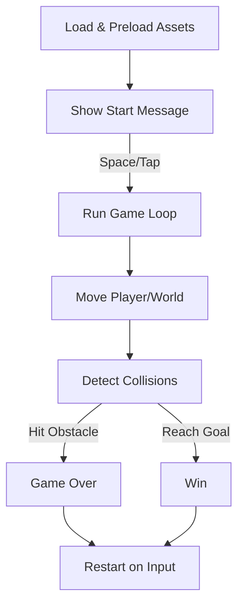

# 🎂 Happy Birthday Ahmad — Game Documentation

---

Welcome to the documentation for **Happy Birthday Ahmad**, a delightful and custom web-based runner game crafted as a birthday present! This game blends playful visuals, musical nostalgia, and simple controls to provide a fun, personalized gaming experience themed around Ahmad and a special mission of love. 

This documentation covers:
- Code architecture and main components
- Game mechanics and user experience
- Asset and data flow
- Interactivity and event handling
- UI/UX details
- How to run and deploy
- Tips for further customization

---

## 📑 Index

- [🎂 Happy Birthday Ahmad — Game Documentation](#-happy-birthday-ahmad--game-documentation)
  - [📑 Index](#-index)
  - [1. Project Overview](#1-project-overview)
  - [2. Game Architecture](#2-game-architecture)
    - [Main Components](#main-components)
    - [Process Flow](#process-flow)
  - [3. User Interface](#3-user-interface)
  - [4. Game Mechanics](#4-game-mechanics)
    - [Player Controls](#player-controls)
    - [Core Loop](#core-loop)
  - [5. Assets \& Resources](#5-assets--resources)
  - [6. Deployment \& Running](#6-deployment--running)
  - [🚦 No API Endpoints](#-no-api-endpoints)

---

## 1. Project Overview

A simple canvas runner game where you dodge obstacles and reach the goal character to win. Personalized art, music, and messages celebrate Ahmad’s birthday.

---

## 2. Game Architecture

### Main Components

- Single-page app: HTML + inline CSS/JS
- Canvas-rendered entities: player, goal, obstacles, clouds
- Audio: background, victory, game-over cues
- UI: scoreboard and status messages

### Process Flow

---

## 3. User Interface

- Responsive canvas centered on the page
- Score and High Score below the canvas
- Contextual messages: start, win, game over
- Themed birthday message block under the game

---

## 4. Game Mechanics

### Player Controls

- Desktop: Space or ArrowUp to start/restart/jump
- Mobile: Tap to start/restart/jump

### Core Loop

- requestAnimationFrame drives updates and rendering
- Player jumps with gravity and collision checked vs. obstacles and goal
- Win by colliding with goal; lose by hitting any obstacle
- Score increases by distance and jumps

---

## 5. Assets & Resources

| Type   | Path                             |
|--------|----------------------------------|
| Player | assets/Ahmad.svg                 |
| Goal   | assets/Martha_heart.svg          |
| Obst.  | assets/Construction.svg, assets/Traffic.svg |
| Cloud  | assets/Cloud.svg                 |
| Audio  | assets/SuperMarioBros.mp3, assets/SuperMarioEnd.mp3, assets/Stage Win (Super Mario).mp3 |

---

## 6. Deployment & Running

- Place `index.html` and `assets/` in the same directory
- Open `index.html` in a modern browser
- Host on any static site provider (GitHub Pages, Netlify, Vercel)

---

## 🚦 No API Endpoints

This is a self-contained front-end game with no external APIs.